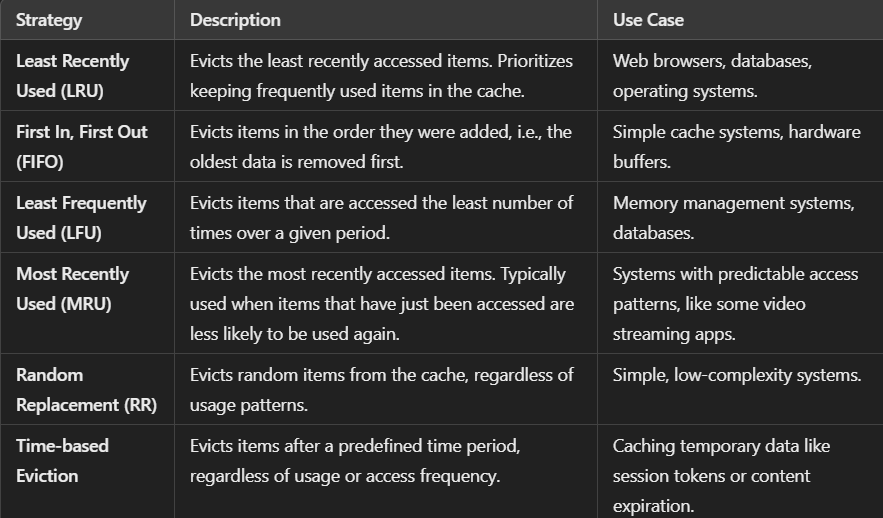

# Cache Eviction
**Cache eviction strategies are techniques used to manage the removal of data from the cache when it reaches its capacity. These strategies ensure that the cache maintains useful and relevant data while optimizing performance.**

## Common Cache Eviction Strategies

## Key Considerations for Cache Eviction
- **Cache Size:** The capacity of the cache determines how aggressive the eviction strategy should be.
- **Access Patterns:** Understanding how data is accessed helps choose the most efficient eviction strategy (e.g., LRU or LFU for frequently accessed data).
- **Data Freshness:** Ensuring that evicted data is still useful, especially in time-sensitive applications, can guide eviction policies.

**Cache eviction is crucial for balancing speed and memory usage in applications.**